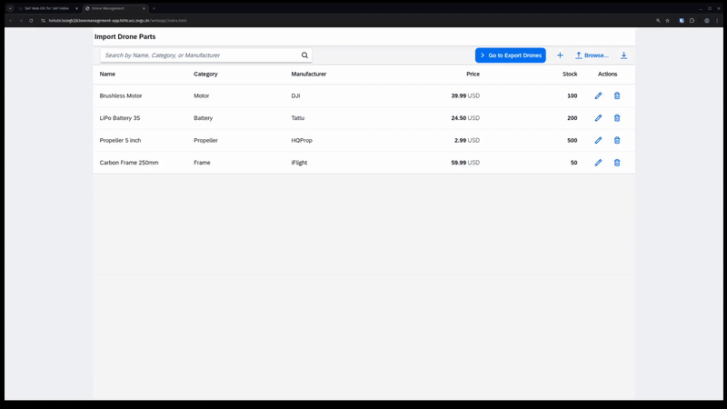

# 🚁 Drone Parts Management System


A comprehensive SAP UI5/Fiori application for managing drone and drone parts inventory with full CRUD operations, bulk import/export capabilities, and real-time data management.

## 📋 Features

- **Drone & Parts Management**: Complete inventory management for both drones and drone parts
- **Full CRUD Operations**: Create, read, update, and delete inventory items
- **Bulk Operations**: Import data from CSV files and export inventory reports
- **Advanced Search & Filter**: Multi-field search functionality across all item attributes
- **Real-time Updates**: Live inventory tracking with immediate data synchronization
- **UUID Management**: Automatic unique identifier generation for all inventory items
- **Responsive Design**: Mobile-friendly interface built with SAP Fiori design principles
- **Data Validation**: Comprehensive client and server-side validation

## 🛠️ Technology Stack

- **Frontend**: SAP UI5/OpenUI5 with Fiori Launchpad
- **Backend**: SAP HANA Database with HDI Container
- **Data Service**: OData V2 Service
- **Database**: SAP HANA with CDS (Core Data Services)
- **Development**: SAP Business Application Studio / SAP Web IDE
- **Runtime**: Node.js

## 🚀 Getting Started

### Prerequisites

- SAP Business Application Studio or SAP Web IDE
- Access to SAP HANA Database
- Node.js (for local development)
- Git (for version control)

## 💾 Database Schema

### DroneParts Entity

| Field        | Type          | Description                    |
|--------------|---------------|--------------------------------|
| ID           | String(36)    | Primary Key (UUID)            |
| Name         | String(100)   | Part name                     |
| Category     | String(50)    | Part category                 |
| Manufacturer | String(100)   | Manufacturer name             |
| Price        | Decimal(10,2) | Unit price                    |
| Stock        | Integer       | Available quantity            |

### Drones Entity

| Field        | Type          | Description                    |
|--------------|---------------|--------------------------------|
| ID           | String(36)    | Primary Key (UUID)            |
| Model        | String(100)   | Drone model name              |
| Manufacturer | String(100)   | Manufacturer name             |
| Type         | String(50)    | Drone type/category           |
| MaxSpeed     | Decimal(5,2)  | Maximum speed (km/h)          |
| MaxRange     | Decimal(6,2)  | Maximum range (km)            |
| BatteryLife  | Integer       | Battery life (minutes)        |
| Weight       | Decimal(6,2)  | Weight (grams)                |
| Price        | Decimal(10,2) | Unit price                    |
| Stock        | Integer       | Available quantity            |

### Entity Relationships

- **DroneParts**: Manages individual components and spare parts inventory
- **Drones**: Manages complete drone units and specifications
- Both entities utilize UUID primary keys for distributed system compatibility
- Independent inventory tracking enables separate management of parts vs. complete units

## 📊 Usage Guide

### Managing Parts

1. Navigate to the **Import Parts** page
2. Click the **"+"** button to add individual parts
3. Fill in required fields: Name, Category, Manufacturer, Price, Stock
4. Click **Save** to create the part

### Bulk Data Import

1. Prepare your CSV file with the following format:
   ```csv
   "uuid","Part Name","Category","Manufacturer",price,stock
   "f9c1d250-1234-4c9f-8a3a-a23456abcd01","Brushless Motor","Motor","DJI",24.99,120
   ```

2. Click **Import from CSV** button
3. Select your prepared CSV file
4. System validates and imports all valid records automatically

### Data Export

- Click **Export to CSV** to download current inventory data
- Exported files include all item information in standard CSV format
- Perfect for backup, reporting, or external system integration

### Search & Filtering

Use the search functionality to filter items by:
- Item/part name
- Category classification  
- Manufacturer information
- Any combination of the above fields

## 🔧 API Endpoints

### OData Service: `/DroneManagement.xsodata`

#### DroneParts Operations
| Operation | Endpoint              | Method | Description           |
|-----------|-----------------------|--------|-----------------------|
| Get All   | `/DroneParts`         | GET    | Retrieve all parts    |
| Get One   | `/DroneParts('id')`   | GET    | Retrieve specific part|
| Create    | `/DroneParts`         | POST   | Create new part       |
| Update    | `/DroneParts('id')`   | PUT    | Update existing part  |
| Delete    | `/DroneParts('id')`   | DELETE | Delete part           |

#### Drones Operations
| Operation | Endpoint              | Method | Description           |
|-----------|-----------------------|--------|-----------------------|
| Get All   | `/Drones`             | GET    | Retrieve all drones   |
| Get One   | `/Drones('id')`       | GET    | Retrieve specific drone|
| Create    | `/Drones`             | POST   | Create new drone      |
| Update    | `/Drones('id')`       | PUT    | Update existing drone |
| Delete    | `/Drones('id')`       | DELETE | Delete drone          |

## 🔍 Development Notes

### UUID Generation
- All inventory items automatically receive UUID v4 identifiers
- UUIDs ensure unique identification across distributed systems
- Standard format: `xxxxxxxx-xxxx-4xxx-yxxx-xxxxxxxxxxxx`

### CSV Import Processing
- Supports both quoted and unquoted field values
- Automatic data type conversion and validation
- Comprehensive field validation before database insertion
- Invalid records are skipped with detailed success reporting

### Error Handling & Validation
- Comprehensive error messaging for all operations
- Multi-layer validation (client-side and server-side)
- Graceful handling of network failures and timeouts
- User-friendly error notifications with actionable feedback

### Performance Considerations
- Batch processing for bulk import operations
- Optimized database queries with proper indexing
- Real-time data refresh without full page reloads
- Efficient memory management for large datasets

## 🤝 Contributing

We welcome contributions! Please follow these steps:

1. Fork the repository
2. Create a feature branch (`git checkout -b feature/AmazingFeature`)
3. Commit your changes (`git commit -m 'Add some AmazingFeature'`)
4. Push to the branch (`git push origin feature/AmazingFeature`)
5. Open a Pull Request

Please ensure your code follows our coding standards and includes appropriate tests.

## 🆘 Support

For support and questions:
- Create an issue in this repository
- Contact the development team
- Check [SAP Community](https://community.sap.com) for UI5/Fiori related questions
- Review the [SAP UI5 Documentation](https://ui5.sap.com)
